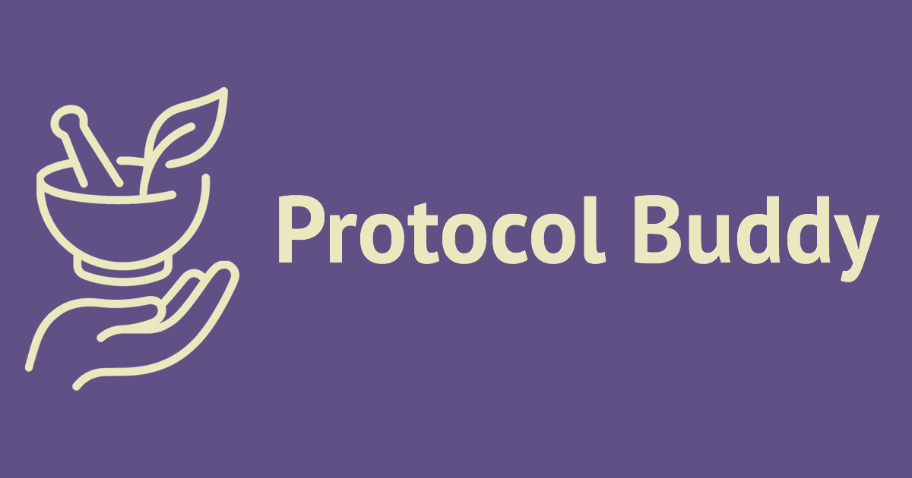

  

# Protocol Buddy - Mobile App

> **Note**: This is a public documentation repository. The source code is maintained in a private repository.

**Google Play Store**: [Download on Google Play](https://play.google.com/store/apps/details?id=com.protocolbuddy.app)

## About

**Protocol Buddy** is a React Native mobile application that provides evidence-based health protocols with interactive dosage calculators. The app helps users safely navigate supplement and therapeutic compound dosing with:

- **Extensive library of evidence-based health protocols** across 15 categories
- **Interactive dosage calculators** with weight-based and fixed dosing
- **In-depth guides** with cross-links to related protocols
- **Protocol stacks** - curated multi-protocol combinations for goals like sleep, longevity, and cognition
- **AskBuddy AI Q&A** for natural-language protocol questions
- **Smart reminders** and calendar integration
- **Research citations** for evidence-based recommendations
- **Dark mode** support for comfortable viewing

### Target Audience

- Longevity researchers and biohackers
- Healthcare practitioners exploring alternative therapies
- Individuals interested in evidence-based supplementation
- Anyone seeking structured health protocol guidance

## Features

### Core Features (Free Tier)

- Browse extensive library of protocols across multiple categories
- View 3 protocol details for free (with full dosage information)
- Search and filter protocols by category
- Read in-depth guides, each cross-linked to its related protocol
- Browse curated protocol stacks (e.g. Sleep Stack, Longevity Stack, Cognitive Stack)
- Ask AskBuddy natural-language questions about protocols (AI-powered)
- Responsive UI with light/dark mode support

### Premium Features

- **Unlimited protocol access** - no view limits
- **Saved protocols** - bookmark and manage your favorite protocols
- **Dosage calculators** - weight-based and liquid dose converters
- **Calendar integration** - set reminders and add protocols to Google Calendar or device calendar
- **Push notifications** - receive reminders directly on your phone for protocol adherence
- **Saved protocols page** - organize and access your protocol library

### Protocol Categories

- Anti-Inflammatory
- Antibacterial
- Antiparasitic
- Antiviral
- Circulation
- Cognitive
- Detoxification
- Gut Health
- Immune Support
- Metabolic
- Mineral
- Pain Relief
- Respiratory
- Vitamin
- Hormonal

## Tech Stack

### Frontend

- **Expo 54** - React Native development platform
- **React Native 0.81** - Mobile app framework
- **React 19.1** - UI library
- **TypeScript 5.9** - Type-safe JavaScript

### Navigation & State Management

- **React Navigation** - Native stack navigation
- **React Context API** - Subscription and theme state
- **React Hook Form** - Form validation
- **Zod** - Schema validation
- **AsyncStorage** - Local data persistence

### UI Components

- **React Native Elements** - UI component library (Slider)
- **Expo Vector Icons** - Icon library

### Content & AI

- **remark** - Renders guide Markdown content to HTML
- **AskBuddy** - AI Q&A powered by the Protocol Buddy web app's AI Q&A endpoint, streamed via the Vercel AI SDK

### Monetization

- **expo-iap** - In-app purchases
- **Google Play Billing Library 8.0** - Android subscriptions

### Other Features

- **Expo Calendar** - Calendar integration
- **Expo Notifications** - Push notifications
- **Expo Font** - Custom fonts (PT Sans)

## Subscription System

### How It Works

**Free Tier:**

- 3 protocol detail views (tracked in AsyncStorage)
- Can browse all protocols
- Cannot access calculators, reminders, or saved protocols

**Premium Tier:**

- Unlimited protocol access
- All premium features unlocked
- Monthly or annual subscription via Google Play

## Notes

All rights reserved.

**Disclaimer**: This app provides educational information only and is not a substitute for professional medical advice. Always consult a healthcare provider before starting any supplement or treatment protocol.
